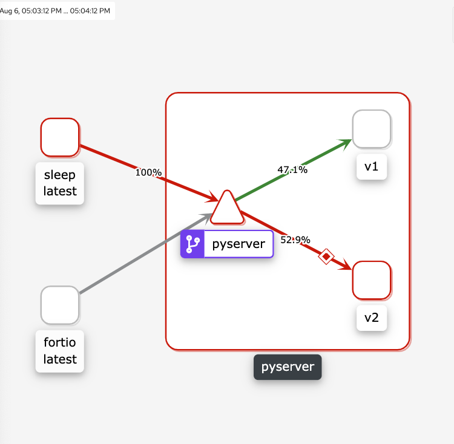
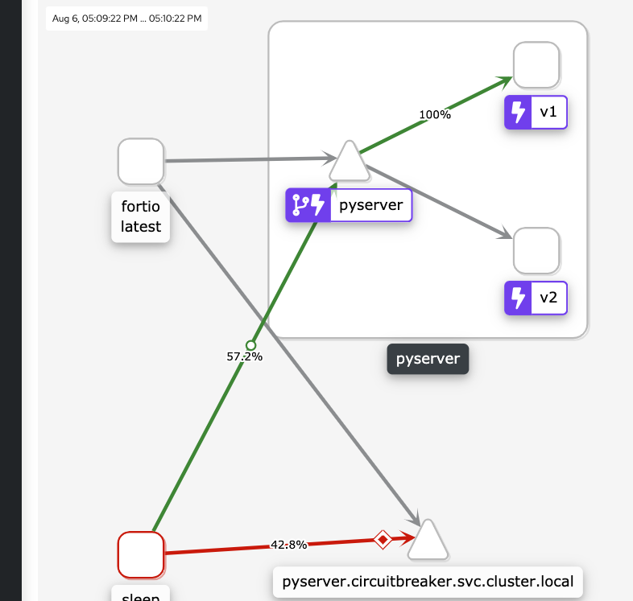
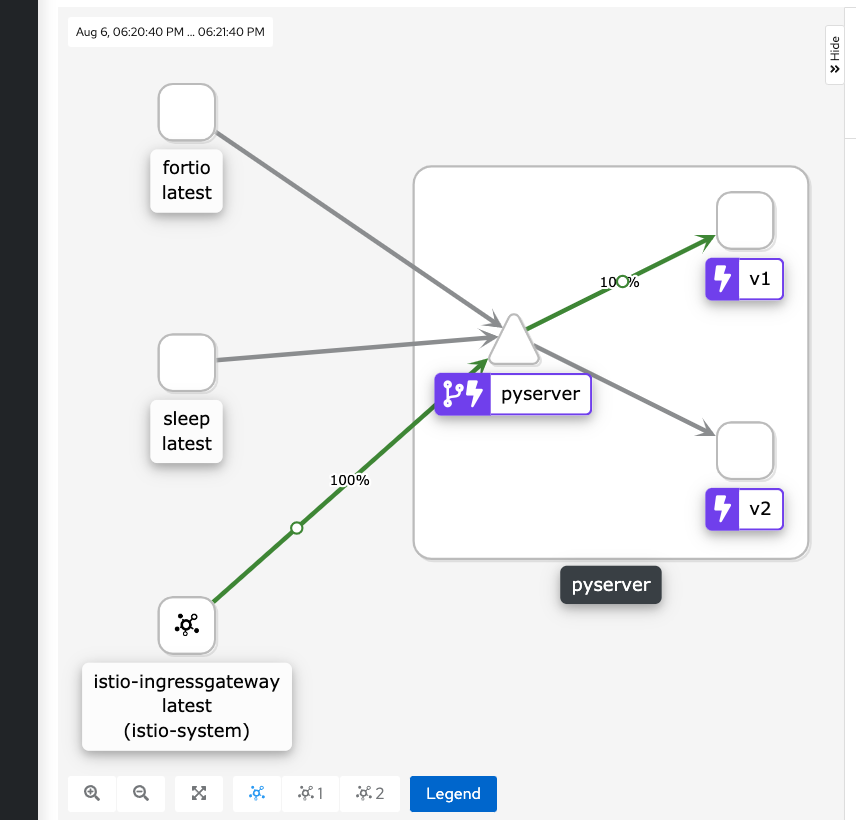
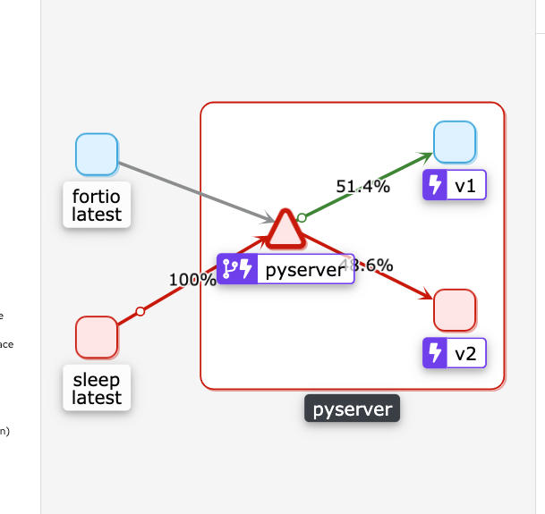

```
# This github was created off of the code, examples, ideas from https://tech.olx.com/demystifying-istio-circuit-breaking-27a69cac2ce4

# Reference
# https://www.envoyproxy.io/docs/envoy/v1.15.4/api-v3/config/cluster/v3/circuit_breaker.proto#envoy-v3-api-field-config-cluster-v3-circuitbreakers-thresholds-retry-budget
# https://blog.turbinelabs.io/circuit-breaking-da855a96a61d - overview of configuring circuit breaking

# fyi I am using python 3.9.6 and assume you have some sort of local kubernetes setup, or have access to EKS, etc. I also assume you have some working knowledge of kubernetes and istio/envoy.

# it's always a good idea to create a virtualenv, and remember to activate it, go into your code repo / root folder
python3 -m venv ~/.venvs/circuitbreaker
source  ~/.venvs/circuitbreaker/bin/activate

If you are are like most of us, you have performed some actions that override default pip - https://confluence.grainger.com/display/PLE/Using+AWS+CodeArtifact#UsingAWSCodeArtifact-PIPPIP

so you must dpctl pip-login first then:

# install flask and requests
pip3 install flask
pip3 install requests   

# to depoly onto minikube remember to set the minikube docker context; this is so that your minikube has access to your docker image
eval $(minikube -p minikube docker-env)  

# then build the docker images for the test apps
# server
docker build -t py_server --file Dockerfile_server . 

# server_502 - this server will be used in later demonstrations but mind as well build it out for now
docker build -t py_server502 --file Dockerfile_server_502 .  

# server_200 - this server will be used in later demonstrations but mind as well build it out for now
docker build -t py_server200 --file Dockerfile_server_200 .  

# client
docker build -t py_client --file Dockerfile_client .

## minikube 
# create a new namespace
kubectl create namespace circuitbreaker 

# enable sidecar injection
kubectl label namespace circuitbreaker istio-injection=enabled --overwrite

# check to see if your namespace, circuitbreaker is enabled
kubectl get namespace -L istio-injection

# deploy the apps 
kubectl apply -f deployment/deployment.yml -n circuitbreaker 


## Testing one client and one server
# max connections 5, notice in the client logs, that only 5 requests get served in about 5 seconds and the other 5 are about 10 seconds
kubectl apply -f deployment/destination_max_5.yml -n circuitbreaker  

# fail fast set http1MaxPendingRequests to 1, so we get 503 error codes - you will typically(not guaranteed) see 5 processes finish about 5 seconds 1 process finish in about 10 seconds then the other 4 fail
kubectl apply -f deployment/destination_fail_fast.yml -n circuitbreaker  

pyclient ----------START BATCH----------
pyclient STATUS: 503, START: 22:26:00, END: 22:26:00, TIME: 0.013655900955200195
pyclient STATUS: 503, START: 22:26:00, END: 22:26:00, TIME: 0.013519287109375 
pyclient STATUS: 503, START: 22:26:00, END: 22:26:00, TIME: 0.04114055633544922
pyclient STATUS: 503, START: 22:26:00, END: 22:26:00, TIME: 0.036191463470458984
pyclient STATUS: 200, START: 22:26:00, END: 22:26:05, TIME: 5.0132763385772705
pyclient STATUS: 200, START: 22:26:00, END: 22:26:05, TIME: 5.019428014755249
pyclient STATUS: 200, START: 22:26:00, END: 22:26:05, TIME: 5.012197494506836
pyclient STATUS: 200, START: 22:26:00, END: 22:26:05, TIME: 5.026354551315308
pyclient STATUS: 200, START: 22:26:00, END: 22:26:05, TIME: 5.019253492355347
pyclient STATUS: 200, START: 22:26:00, END: 22:26:10, TIME: 10.016169786453247

## Testing one client and and multiple (3) servers
kubectl scale deployment/pyserver --replicas=3

So we are still using the deployment/destination_fail_fast.yml configuration. What are our expectations, that since we have 3 servers we should have 3 times the capacity regarding the circuit breaker? If you look at the logs the failure/success rate are similar to if we just had one server.  This tells us the destination config applies to the "service" and not the "pods"

Let' see how many servers our client is hooked up to

kubectl exec $(kubectl get pod --selector app=pyclient --output jsonpath='{.items[0].metadata.name}') -c istio-proxy -- curl -X POST http://localhost:15000/clusters | grep pyserver | grep cx_active

  % Total    % Received % Xferd  Average Speed   Time    Time     Time  Current
                                 Dload  Upload   Total   Spent    Left  Speed
100 88010    0 88010    0     0  13.9M      0 --:--:-- --:--:-- --:--:-- 13.9M
outbound|80||pyserver.circuitbreaker.svc.cluster.local::172.17.0.15:5000::cx_active::2
outbound|80||pyserver.circuitbreaker.svc.cluster.local::172.17.0.16:5000::cx_active::2
outbound|80||pyserver.circuitbreaker.svc.cluster.local::172.17.0.20:5000::cx_active::2

The client proxy has 2 active connections to each pod in the target service. Instead of 5, it is 6. As mentioned in both Envoy and Istio docs, the proxy allows some leeway in terms of the number of connections.


## Testing multiple(3) clients and and a single server
kubectl scale deployment/pyserver --replicas=1
kubectl scale deployment/pyclient --replicas=3

# you see there are 7 200 response codes and the rest are 503s, there is leeway here for the limiting, and human error regarding me copying the logs and getting the correct time span, etc

# The client proxies are sending requests as per their connection limit (5 each) — either queuing or throttling (with UO response flag) excess requests. All three client proxies combined can send a maximum of 15 concurrent requests at the start of a batch. However, only 5 of these succeed because the destination service proxy is also applying throttling using the same configuration (max 5 connections). The destination service proxy will accept only 5 requests and throttle the rest
# Note: I reordered these logs by client id to make it simpler to read

pyclient-754df7b797-8hcw4:pyclient STATUS: 503, START: 13:04:00, END: 13:04:00, TIME: 0.02455282211303711            
pyclient-754df7b797-8hcw4:pyclient STATUS: 503, START: 13:04:00, END: 13:04:00, TIME: 0.0260317325592041             
pyclient-754df7b797-8hcw4:pyclient STATUS: 503, START: 13:04:00, END: 13:04:00, TIME: 0.0184476375579834             
pyclient-754df7b797-8hcw4:pyclient STATUS: 503, START: 13:04:00, END: 13:04:00, TIME: 0.03736472129821777            
pyclient-754df7b797-8hcw4:pyclient STATUS: 503, START: 13:04:00, END: 13:04:00, TIME: 0.061296701431274414         
pyclient-754df7b797-8hcw4:pyclient STATUS: 503, START: 13:04:00, END: 13:04:00, TIME: 0.07179713249206543          
pyclient-754df7b797-8hcw4:pyclient STATUS: 503, START: 13:04:00, END: 13:04:00, TIME: 0.07249307632446289          
pyclient-754df7b797-8hcw4:pyclient STATUS: 200, START: 13:04:00, END: 13:04:05, TIME: 5.027925968170166            
pyclient-754df7b797-8hcw4:pyclient STATUS: 200, START: 13:04:00, END: 13:04:05, TIME: 5.0313026905059814           
pyclient-754df7b797-8hcw4:pyclient STATUS: 200, START: 13:04:00, END: 13:04:10, TIME: 9.754595756530762            

pyclient-754df7b797-82csz:pyclient STATUS: 503, START: 13:04:00, END: 13:04:00, TIME: 0.023135900497436523           
pyclient-754df7b797-82csz:pyclient STATUS: 503, START: 13:04:00, END: 13:04:00, TIME: 0.07111549377441406          
pyclient-754df7b797-82csz:pyclient STATUS: 503, START: 13:04:00, END: 13:04:00, TIME: 0.07547163963317871          
pyclient-754df7b797-82csz:pyclient STATUS: 503, START: 13:04:00, END: 13:04:00, TIME: 0.03539896011352539            
pyclient-754df7b797-82csz:pyclient STATUS: 503, START: 13:04:00, END: 13:04:00, TIME: 0.02215862274169922            
pyclient-754df7b797-82csz:pyclient STATUS: 503, START: 13:04:00, END: 13:04:00, TIME: 0.030635833740234375           
pyclient-754df7b797-82csz:pyclient STATUS: 503, START: 13:04:00, END: 13:04:00, TIME: 0.021790742874145508           
pyclient-754df7b797-82csz:pyclient STATUS: 503, START: 13:04:00, END: 13:04:00, TIME: 0.027550697326660156         
pyclient-754df7b797-82csz:pyclient STATUS: 503, START: 13:04:00, END: 13:04:00, TIME: 0.032232046127319336         
pyclient-754df7b797-82csz:pyclient STATUS: 503, START: 13:04:00, END: 13:04:00, TIME: 0.04988551139831543          

pyclient-754df7b797-5x28s:pyclient STATUS: 503, START: 13:04:00, END: 13:04:00, TIME: 0.020582914352416992            
pyclient-754df7b797-5x28s:pyclient STATUS: 503, START: 13:04:00, END: 13:04:00, TIME: 0.03146672248840332            
pyclient-754df7b797-5x28s:pyclient STATUS: 200, START: 13:04:00, END: 13:04:05, TIME: 5.02578592300415             
pyclient-754df7b797-5x28s:pyclient STATUS: 200, START: 13:04:00, END: 13:04:05, TIME: 5.0246076583862305           
pyclient-754df7b797-5x28s:pyclient STATUS: 200, START: 13:04:00, END: 13:04:05, TIME: 5.017606735229492            
pyclient-754df7b797-5x28s:pyclient STATUS: 200, START: 13:04:00, END: 13:04:10, TIME: 10.028623580932617           
pyclient-754df7b797-5x28s:pyclient STATUS: 503, START: 13:04:20, END: 13:04:20, TIME: 0.014750242233276367         
pyclient-754df7b797-5x28s:pyclient STATUS: 503, START: 13:04:20, END: 13:04:20, TIME: 0.024194002151489258         
pyclient-754df7b797-5x28s:pyclient STATUS: 503, START: 13:04:20, END: 13:04:20, TIME: 0.023208141326904297         
pyclient-754df7b797-5x28s:pyclient STATUS: 503, START: 13:04:20, END: 13:04:20, TIME: 0.0331878662109375           

# if you don't have access logs run the following
istioctl install --set meshConfig.accessLogFile=/dev/stdout 

# get the access logs
# The first thing we notice is RESPONSE_FLAGS — UO and URX . Let’s see what these mean:
# UO : Upstream overflow (circuit breaking)
# URX : The request was rejected because the upstream retry limit (HTTP) or maximum connect attempts (TCP) was reached.
# Now it’s starting to make some sense. Requests with UO flag are throttled locally by the client proxy. Requests with URX flag are rejected by the destination service proxy. This is also corroborated by values of other fields in the log such as DURATION , UPSTREAM_HOST and UPSTREAM_CLUSTER .
These are usually in the logs when you are in the "Deployments" tab of K9S
- or -
kubectl logs -l app=pyclient -c istio-proxy 
[2021-08-05T17:18:40.397Z] "GET /index HTTP/1.1" 503 UO "-" "-" 0 81 0 - "-" "python-requests/2.26.0" "2e520630-01e9-4857-9d71-d8219f261af2" "pyserver" "-" - - 10.103.127.9:80 172.17.0.12:48556 - default
[2021-08-05T17:18:40.397Z] "GET /index HTTP/1.1" 503 UO "-" "-" 0 81 0 - "-" "python-requests/2.26.0" "7d7ac348-33ea-4b9e-b0ff-8ed7c02d5392" "pyserver" "-" - - 10.103.127.9:80 172.17.0.12:48558 - default
[2021-08-05T17:18:40.397Z] "GET /index HTTP/1.1" 503 UO "-" "-" 0 81 0 - "-" "python-requests/2.26.0" "2e6b0765-778a-423f-b4dd-28f506b3b28c" "pyserver" "-" - - 10.103.127.9:80 172.17.0.12:48560 - default
[2021-08-05T17:18:40.398Z] "GET /index HTTP/1.1" 503 UO "-" "-" 0 81 0 - "-" "python-requests/2.26.0" "8ca6c990-4813-4be3-96eb-dfe4894202a2" "pyserver" "-" - - 10.103.127.9:80 172.17.0.12:48562 - default
[2021-08-05T17:18:40.402Z] "GET /index HTTP/1.1" 503 UO "-" "-" 0 81 0 - "-" "python-requests/2.26.0" "349d6869-d8b6-45c3-ae52-07f4a95eaf61" "pyserver" "-" - - 10.103.127.9:80 172.17.0.12:48564 - default
[2021-08-05T17:18:40.390Z] "GET /index HTTP/1.1" 200 - "-" "-" 0 5 5008 5008 "-" "python-requests/2.26.0" "23be68fe-8bd1-4fe0-a871-569a20d7fa34" "pyserver" "172.17.0.15:5000" outbound|80||pyserver.circuitbreaker.svc.cluster.local 172.17.0.12:59252 10.103.127.9:80 172.17.0.12:48548 - default
[2021-08-05T17:18:40.390Z] "GET /index HTTP/1.1" 200 - "-" "-" 0 5 5010 5010 "-" "python-requests/2.26.0" "128c7376-ca62-4190-8b05-1125b2e3ccd2" "pyserver" "172.17.0.15:5000" outbound|80||pyserver.circuitbreaker.svc.cluster.local 172.17.0.12:55812 10.103.127.9:80 172.17.0.12:48546 - default
[2021-08-05T17:18:40.402Z] "GET /index HTTP/1.1" 200 - "-" "-" 0 5 5008 5008 "-" "python-requests/2.26.0" "8645af01-c71e-46a3-bcc7-7a5aa8259a32" "pyserver" "172.17.0.15:5000" outbound|80||pyserver.circuitbreaker.svc.cluster.local 172.17.0.12:58122 10.103.127.9:80 172.17.0.12:48568 - default
[2021-08-05T17:18:40.403Z] "GET /index HTTP/1.1" 200 - "-" "-" 0 5 5008 5007 "-" "python-requests/2.26.0" "e4261656-ff4b-4501-9b76-a16b8897a8f0" "pyserver" "172.17.0.15:5000" outbound|80||pyserver.circuitbreaker.svc.cluster.local 172.17.0.12:59818 10.103.127.9:80 172.17.0.12:48566 - default
[2021-08-05T17:18:40.394Z] "GET /index HTTP/1.1" 200 - "-" "-" 0 5 10015 10015 "-" "python-requests/2.26.0" "adccc6ea-56b9-47c3-b452-a3ac1b034b00" "pyserver" "172.17.0.15:5000" outbound|80||pyserver.circuitbreaker.svc.cluster.local 172.17.0.12:55812 10.103.127.9:80 172.17.0.12:48554 - default
[2021-08-05T17:18:40.463Z] "GET /index HTTP/1.1" 503 UO "-" "-" 0 81 0 - "-" "python-requests/2.26.0" "44740855-8fee-44ce-8034-526dfcdd9b72" "pyserver" "-" - - 10.103.127.9:80 172.17.0.16:38542 - default
[2021-08-05T17:18:40.463Z] "GET /index HTTP/1.1" 503 UO "-" "-" 0 81 0 - "-" "python-requests/2.26.0" "5da40781-1c4e-4bb0-a951-ad16200a8063" "pyserver" "-" - - 10.103.127.9:80 172.17.0.16:38554 - default
[2021-08-05T17:18:40.464Z] "GET /index HTTP/1.1" 503 UO "-" "-" 0 81 0 - "-" "python-requests/2.26.0" "0cdc8df1-458a-444b-a6c0-31503d01b7b9" "pyserver" "-" - - 10.103.127.9:80 172.17.0.16:38544 - default
[2021-08-05T17:18:40.465Z] "GET /index HTTP/1.1" 503 UO "-" "-" 0 81 0 - "-" "python-requests/2.26.0" "20c6b5b2-03a9-4d38-b0ab-654c117aa6f4" "pyserver" "-" - - 10.103.127.9:80 172.17.0.16:38556 - default
[2021-08-05T17:18:40.465Z] "GET /index HTTP/1.1" 503 UO "-" "-" 0 81 0 - "-" "python-requests/2.26.0" "008235fe-1266-449c-a237-0423fadd36e1" "pyserver" "-" - - 10.103.127.9:80 172.17.0.16:38548 - default
[2021-08-05T17:18:40.463Z] "GET /index HTTP/1.1" 503 URX "-" "-" 0 81 13 13 "-" "python-requests/2.26.0" "f6661142-54aa-4536-a001-a41777382a88" "pyserver" "172.17.0.15:5000" outbound|80||pyserver.circuitbreaker.svc.cluster.local 172.17.0.16:57988 10.103.127.9:80 172.17.0.16:38546 - default
[2021-08-05T17:18:40.465Z] "GET /index HTTP/1.1" 503 URX "-" "-" 0 81 37 37 "-" "python-requests/2.26.0" "8ae10c69-faba-44a3-9213-2848d74ef679" "pyserver" "172.17.0.15:5000" outbound|80||pyserver.circuitbreaker.svc.cluster.local 172.17.0.16:57992 10.103.127.9:80 172.17.0.16:38550 - default
[2021-08-05T17:18:40.458Z] "GET /index HTTP/1.1" 503 URX "-" "-" 0 81 70 70 "-" "python-requests/2.26.0" "14071957-de2b-47ee-aaa4-1de4c5a671c1" "pyserver" "172.17.0.15:5000" outbound|80||pyserver.circuitbreaker.svc.cluster.local 172.17.0.16:57994 10.103.127.9:80 172.17.0.16:38538 - default
[2021-08-05T17:18:40.451Z] "GET /index HTTP/1.1" 200 - "-" "-" 0 5 5007 5007 "-" "python-requests/2.26.0" "5fa28ea5-1aa0-4302-941e-6338da8456d0" "pyserver" "172.17.0.15:5000" outbound|80||pyserver.circuitbreaker.svc.cluster.local 172.17.0.16:57436 10.103.127.9:80 172.17.0.16:38532 - default
[2021-08-05T17:18:40.451Z] "GET /index HTTP/1.1" 200 - "-" "-" 0 5 9956 9955 "-" "python-requests/2.26.0" "459865b0-6c88-43eb-b99e-451979aa55e2" "pyserver" "172.17.0.15:5000" outbound|80||pyserver.circuitbreaker.svc.cluster.local 172.17.0.16:57434 10.103.127.9:80 172.17.0.16:38534 - default
[2021-08-05T17:18:40.543Z] "GET /index HTTP/1.1" 503 UO "-" "-" 0 81 1 - "-" "python-requests/2.26.0" "caea1c70-7588-4479-ace4-1e76b7bbb5d7" "pyserver" "-" - 172.17.0.20:34246 10.103.127.9:80 172.17.0.20:48492 - default
[2021-08-05T17:18:40.548Z] "GET /index HTTP/1.1" 503 UO "-" "-" 0 81 0 - "-" "python-requests/2.26.0" "849c026e-435c-4515-8663-139bd5e287e1" "pyserver" "-" - - 10.103.127.9:80 172.17.0.20:48506 - default
[2021-08-05T17:18:40.549Z] "GET /index HTTP/1.1" 503 UO "-" "-" 0 81 0 - "-" "python-requests/2.26.0" "555dea08-3683-4356-99cc-5dd29c7f04a8" "pyserver" "-" - - 10.103.127.9:80 172.17.0.20:48510 - default
[2021-08-05T17:18:40.551Z] "GET /index HTTP/1.1" 503 UO "-" "-" 0 81 0 - "-" "python-requests/2.26.0" "636bb39b-6cf6-4b87-9707-d1abf144bf65" "pyserver" "-" - - 10.103.127.9:80 172.17.0.20:48514 - default
[2021-08-05T17:18:40.551Z] "GET /index HTTP/1.1" 503 URX "-" "-" 0 81 33 33 "-" "python-requests/2.26.0" "a6476167-100f-4e39-b656-e585e47d85c7" "pyserver" "172.17.0.15:5000" outbound|80||pyserver.circuitbreaker.svc.cluster.local 172.17.0.20:34282 10.103.127.9:80 172.17.0.20:48512 - default
[2021-08-05T17:18:40.548Z] "GET /index HTTP/1.1" 503 URX "-" "-" 0 81 42 41 "-" "python-requests/2.26.0" "7c14108c-3865-4ece-bf79-0627899db4cf" "pyserver" "172.17.0.15:5000" outbound|80||pyserver.circuitbreaker.svc.cluster.local 172.17.0.20:34284 10.103.127.9:80 172.17.0.20:48504 - default
[2021-08-05T17:18:40.539Z] "GET /index HTTP/1.1" 503 URX "-" "-" 0 81 52 52 "-" "python-requests/2.26.0" "6209e077-51e4-4f08-8f31-7771cddd7b59" "pyserver" "172.17.0.15:5000" outbound|80||pyserver.circuitbreaker.svc.cluster.local 172.17.0.20:34282 10.103.127.9:80 172.17.0.20:48488 - default
[2021-08-05T17:18:40.547Z] "GET /index HTTP/1.1" 503 URX "-" "-" 0 81 47 47 "-" "python-requests/2.26.0" "3244f26a-420c-482f-bc15-31deb2bda531" "pyserver" "172.17.0.15:5000" outbound|80||pyserver.circuitbreaker.svc.cluster.local 172.17.0.20:34284 10.103.127.9:80 172.17.0.20:48500 - default
[2021-08-05T17:18:40.543Z] "GET /index HTTP/1.1" 503 URX "-" "-" 0 81 63 63 "-" "python-requests/2.26.0" "d67f63e0-7361-454e-baeb-4b80622a152e" "pyserver" "172.17.0.15:5000" outbound|80||pyserver.circuitbreaker.svc.cluster.local 172.17.0.20:34284 10.103.127.9:80 172.17.0.20:48486 - default
[2021-08-05T17:18:40.546Z] "GET /index HTTP/1.1" 503 URX "-" "-" 0 81 66 65 "-" "python-requests/2.26.0" "24a2ebbe-da51-4bdc-ac35-afcea48f3fd7" "pyserver" "172.17.0.15:5000" outbound|80||pyserver.circuitbreaker.svc.cluster.local 172.17.0.20:34282 10.103.127.9:80 172.17.0.20:48490 - default


## Testing multiple(3) clients and and multiple (3) servers
kubectl scale deployment/pyserver --replicas=3


# There are about 20 or so 200s and the rest are 503s, as mentioned before, due to human error and selecting the correct time range to cut and paste the math may not work out perfectly
# Note: I reordered these logs by client id to make it simpler to read

pyclient-754df7b797-8hcw4:pyclient STATUS: 200, START: 13:40:40, END: 13:40:50, TIME: 10.02450156211853               
pyclient-754df7b797-8hcw4:pyclient STATUS: 503, START: 13:41:00, END: 13:41:00, TIME: 0.006125211715698242                      
pyclient-754df7b797-8hcw4:pyclient STATUS: 503, START: 13:41:00, END: 13:41:00, TIME: 0.005243062973022461                      
pyclient-754df7b797-8hcw4:pyclient STATUS: 503, START: 13:41:00, END: 13:41:00, TIME: 0.015581130981445312                      
pyclient-754df7b797-8hcw4:pyclient STATUS: 200, START: 13:41:00, END: 13:41:05, TIME: 5.020694971084595                         
pyclient-754df7b797-8hcw4:pyclient STATUS: 200, START: 13:41:00, END: 13:41:05, TIME: 5.017241954803467                         
pyclient-754df7b797-8hcw4:pyclient STATUS: 200, START: 13:41:00, END: 13:41:05, TIME: 5.020987272262573                         
pyclient-754df7b797-8hcw4:pyclient STATUS: 200, START: 13:41:00, END: 13:41:05, TIME: 5.030030250549316                         
pyclient-754df7b797-8hcw4:pyclient STATUS: 200, START: 13:41:00, END: 13:41:05, TIME: 5.027225494384766                         
pyclient-754df7b797-8hcw4:pyclient STATUS: 200, START: 13:41:00, END: 13:41:05, TIME: 5.0390379428863525                        
pyclient-754df7b797-8hcw4:pyclient STATUS: 200, START: 13:41:00, END: 13:41:10, TIME: 10.04430103302002                         
pyclient-754df7b797-8hcw4:pyclient STATUS: 503, START: 13:41:20, END: 13:41:20, TIME: 0.019423723220825195                      
pyclient-754df7b797-8hcw4:pyclient STATUS: 503, START: 13:41:20, END: 13:41:20, TIME: 0.01883387565612793                       
pyclient-754df7b797-8hcw4:pyclient STATUS: 503, START: 13:41:20, END: 13:41:20, TIME: 0.005733013153076172                      

pyclient-754df7b797-82csz:pyclient STATUS: 200, START: 13:40:40, END: 13:40:51, TIME: 10.023693084716797             
pyclient-754df7b797-82csz:pyclient STATUS: 503, START: 13:41:01, END: 13:41:01, TIME: 0.004535198211669922                      
pyclient-754df7b797-82csz:pyclient STATUS: 503, START: 13:41:00, END: 13:41:01, TIME: 0.03052520751953125                       
pyclient-754df7b797-82csz:pyclient STATUS: 503, START: 13:41:00, END: 13:41:01, TIME: 0.02593827247619629                       
pyclient-754df7b797-82csz:pyclient STATUS: 503, START: 13:41:00, END: 13:41:01, TIME: 0.03455615043640137                       
pyclient-754df7b797-82csz:pyclient STATUS: 200, START: 13:41:00, END: 13:41:06, TIME: 5.018983840942383                         
pyclient-754df7b797-82csz:pyclient STATUS: 200, START: 13:41:00, END: 13:41:06, TIME: 5.022255897521973                         
pyclient-754df7b797-82csz:pyclient STATUS: 200, START: 13:41:00, END: 13:41:06, TIME: 5.0205981731414795                        
pyclient-754df7b797-82csz:pyclient STATUS: 200, START: 13:41:00, END: 13:41:10, TIME: 9.07216501235962                          
pyclient-754df7b797-82csz:pyclient STATUS: 200, START: 13:41:00, END: 13:41:10, TIME: 9.067094802856445                         
pyclient-754df7b797-82csz:pyclient STATUS: 200, START: 13:41:00, END: 13:41:11, TIME: 10.02340292930603                         
pyclient-754df7b797-82csz:pyclient STATUS: 503, START: 13:41:21, END: 13:41:21, TIME: 0.008643627166748047                      
pyclient-754df7b797-82csz:pyclient STATUS: 503, START: 13:41:21, END: 13:41:21, TIME: 0.00825643539428711                       
pyclient-754df7b797-82csz:pyclient STATUS: 503, START: 13:41:21, END: 13:41:21, TIME: 0.028911590576171875             

pyclient-754df7b797-5x28s:pyclient STATUS: 503, START: 13:41:00, END: 13:41:00, TIME: 0.025067806243896484           
pyclient-754df7b797-5x28s:pyclient STATUS: 503, START: 13:41:00, END: 13:41:00, TIME: 0.01529240608215332            
pyclient-754df7b797-5x28s:pyclient STATUS: 200, START: 13:41:00, END: 13:41:05, TIME: 5.017366647720337                         
pyclient-754df7b797-5x28s:pyclient STATUS: 200, START: 13:41:00, END: 13:41:05, TIME: 5.021098375320435                         
pyclient-754df7b797-5x28s:pyclient STATUS: 200, START: 13:41:00, END: 13:41:05, TIME: 5.013646364212036                         
pyclient-754df7b797-5x28s:pyclient STATUS: 200, START: 13:41:00, END: 13:41:05, TIME: 5.031948566436768                         
pyclient-754df7b797-5x28s:pyclient STATUS: 200, START: 13:41:00, END: 13:41:05, TIME: 5.01352071762085                          
pyclient-754df7b797-5x28s:pyclient STATUS: 200, START: 13:41:00, END: 13:41:05, TIME: 5.027798414230347                         
pyclient-754df7b797-5x28s:pyclient STATUS: 200, START: 13:41:00, END: 13:41:10, TIME: 10.946386098861694                        
pyclient-754df7b797-5x28s:pyclient STATUS: 503, START: 13:41:20, END: 13:41:20, TIME: 0.005594968795776367                      
pyclient-754df7b797-5x28s:pyclient STATUS: 503, START: 13:41:20, END: 13:41:20, TIME: 0.017403841018676758                      
pyclient-754df7b797-5x28s:pyclient STATUS: 503, START: 13:41:20, END: 13:41:20, TIME: 0.016326427459716797                      


# If we increase the number of server replicas to 2, we should see 10 requests succeeding amongst 30 requests generated by all 3 client proxies in a batch. We’d still observe throttling on both client and destination service proxies.
# If we increase server replicas to 3, we should see 15 successful requests
# If we increase the number to 4, we should still see only 15 successful requests. Why? Well, remember the throttling on the client proxy is applied for the destination service overall, irrespective of how many replicas the destination service has. So each client proxy can make a maximum of 5 concurrent requests to the destination service no matter how many replicas are there.

Conclusion for max connections deep dive
# So it seems like if we have a matching number of client and servers the max connections allowed are multiplied by the matching number of client and servers, 3 in this case
# Any mismatch in count, say 1 client and 3 servers, will limit the max connections to 5; since there is only one client connecting to one service basically, even though 3 are available; and if you have 3 clients and 1 server, they split that max connection between the 3 clients, approximately 2 each, in this case


# Some stats
kubectl exec $(kubectl get pod --selector app=pyclient --output jsonpath='{.items[0].metadata.name}') -c istio-proxy -- curl -X POST http://localhost:15000/clusters | grep pyserver 
  % Total    % Received % Xferd  Average Speed   Time    Time     Time  Current
                                 Dload  Upload   Total   Spent    Left  Speed
  0     0    0     0    0     0      0      0 --:--:-- --:--:-- --:--:--     0
outbound|80||pyserver.circuitbreaker.svc.cluster.local::default_priority::max_connections::5
outbound|80||pyserver.circuitbreaker.svc.cluster.local::default_priority::max_pending_requests::1
outbound|80||pyserver.circuitbreaker.svc.cluster.local::default_priority::max_requests::4294967295
outbound|80||pyserver.circuitbreaker.svc.cluster.local::default_priority::max_retries::4294967295
outbound|80||pyserver.circuitbreaker.svc.cluster.local::high_priority::max_connections::1024
outbound|80||pyserver.circuitbreaker.svc.cluster.local::high_priority::max_pending_requests::1024
outbound|80||pyserver.circuitbreaker.svc.cluster.local::high_priority::max_requests::1024
outbound|80||pyserver.circuitbreaker.svc.cluster.local::high_priority::max_retries::3
outbound|80||pyserver.circuitbreaker.svc.cluster.local::added_via_api::true
outbound|80||pyserver.circuitbreaker.svc.cluster.local::172.17.0.15:5000::cx_active::5
outbound|80||pyserver.circuitbreaker.svc.cluster.local::172.17.0.15:5000::cx_connect_fail::0
outbound|80||pyserver.circuitbreaker.svc.cluster.local::172.17.0.15:5000::cx_total::3748
outbound|80||pyserver.circuitbreaker.svc.cluster.local::172.17.0.15:5000::rq_active::0
outbound|80||pyserver.circuitbreaker.svc.cluster.local::172.17.0.15:5000::rq_error::5041
outbound|80||pyserver.circuitbreaker.svc.cluster.local::172.17.0.15:5000::rq_success::8146
outbound|80||pyserver.circuitbreaker.svc.cluster.local::172.17.0.15:5000::rq_timeout::0
outbound|80||pyserver.circuitbreaker.svc.cluster.local::172.17.0.15:5000::rq_total::13187
outbound|80||pyserver.circuitbreaker.svc.cluster.local::172.17.0.15:5000::hostname::
outbound|80||pyserver.circuitbreaker.svc.cluster.local::172.17.0.15:5000::health_flags::healthy
outbound|80||pyserver.circuitbreaker.svc.cluster.local::172.17.0.15:5000::weight::1
outbound|80||pyserver.circuitbreaker.svc.cluster.local::172.17.0.15:5000::region::
outbound|80||pyserver.circuitbreaker.svc.cluster.local::172.17.0.15:5000::zone::
outbound|80||pyserver.circuitbreaker.svc.cluster.local::172.17.0.15:5000::sub_zone::
outbound|80||pyserver.circuitbreaker.svc.cluster.local::172.17.0.15:5000::canary::false
outbound|80||pyserver.circuitbreaker.svc.cluster.local::172.17.0.15:5000::priority::0
outbound|80||pyserver.circuitbreaker.svc.cluster.local::172.17.0.15:5000::success_rate::-1.0
outbound|80||pyserver.circuitbreaker.svc.cluster.local::172.17.0.15:5000::local_origin_success_rate::-1.0
100 90533    0 90533    0     0  9823k      0 --:--:-- --:--:-- --:--:-- 10.7M


## Example of one bad server and one good server and no gateway defined - the checked in code has a gateway you can just remove it and any reference to it. Not sure if it is a good idea to not have a gateway defined. Will need to read up on that.

# delete the old deployment we ran above
kubectl delete -f deployment/deployment.yml -n circuitbreaker 

# apply the new deployment file
kubectl apply -f deployment/deployment_502.yml -n circuitbreaker 

# apply the bad.yml - this just splits traffic between the pyserver200 and pyserver502 - so you will get a mix of 200 and 502 response codes
# note this virtual service has retry logic in it also - https://istio.io/v1.7/docs/concepts/traffic-management/#retries
kubectl apply -f deployment/bad.yml -n circuitbreaker 

# we are doing round robin load balancing, but it may not always look like it - https://www.envoyproxy.io/docs/envoy/latest/faq/load_balancing/concurrency_lb
# to hit the server multiple times, the following will do
for i in {1..5};  do kubectl exec $(kubectl get pod -l app=sleep -n circuitbreaker -o jsonpath={.items..metadata.name}) -c sleep -n circuitbreaker -- curl  -I http://pyserver/index; sleep 1; done 
-or-
while true; do kubectl exec $(kubectl get pod -l app=sleep -n circuitbreaker -o jsonpath={.items..metadata.name}) -c sleep -n circuitbreaker -- curl  -I http://pyserver/index; sleep 1; done  

# So it looks like the pod gets ejected (the bad pod is returning a 502), but afterwards we start getting 503s; so the load balancer seems to be hitting it
https://discuss.istio.io/t/istio-give-503-error-with-no-healthy-upstream-when-pods-get-evicted/6069/3


# how to check if the outlier worked, appears to be working
kubectl get pods -n circuitbreaker
NAME                             READY   STATUS    RESTARTS   AGE
fortio-deploy-576dbdfbc4-cbc9b   2/2     Running   0          22m
pyserver-v1-7c9d68c88c-x89mw     2/2     Running   0          19m
pyserver-v2-6558c4f599-pg2fg     2/2     Running   0          19m
sleep-854565cb79-45z26           2/2     Running   0          19m

# this doesn't always work, like the pod is unrecognized at times 
istioctl pc endpoints fortio-deploy-576dbdfbc4-cbc9b | grep pyserver
172.17.0.16:5000                 HEALTHY     FAILED            outbound|80|v2|pyserver.circuitbreaker.svc.cluster.local
172.17.0.16:5000                 HEALTHY     OK                outbound|80||pyserver.circuitbreaker.svc.cluster.local


Even though the above results show 503 still the Kiali topological graph shows otherwise, maybe it's something to do with calling the api from an internal app vs doing a curl on the terminal to an actual endpoint. I will test this out. Regardless at the bottom of this REAADME are some images to show this.  At this point I have not added a Gateway


## now if you want to add a gateway, which may be the right thing to do anyway. Checked in code has gateway code
you have to first run
minikube tunnel

# then double check your external IP 
kubectl get svc istio-ingressgateway -n istio-system
NAME                   TYPE           CLUSTER-IP     EXTERNAL-IP   PORT(S)                                                                      AGE
istio-ingressgateway   LoadBalancer   10.108.70.51   127.0.0.1     15021:31543/TCP,80:30147/TCP,443:30001/TCP,31400:32365/TCP,15443:31370/TCP   102m

# infinite curl external endpoint
 while true; do curl -I  localhost/index; sleep .5; done 

This seems to be evicting and redirecting traffic correctly look for images below.

# infinite curl internal via kubectl
while true;  do kubectl exec $(kubectl get pod -l app=sleep -n circuitbreaker -o jsonpath={.items..metadata.name}) -c sleep -n circuitbreaker -- curl  -I http://pyserver/index; sleep 1; done

This appears to be bypassing at the minimum the VirtualService and the DestinationRule.  In the VirtualService I changed the route weights from 50/50 to 90/10 and yet the Kiali graph still shows 50/50. Look for images below

There is one concern and it was a concern that was noted on the test without the gateway. Even though graphically things look good in this scenario. I was still getting 503s on the external curl. The 503's are legit, there is no upstream, vs the 502 error my service was returning. I am not sure what is going on here. There is a discussion about it; but without a clear answer:
https://discuss.istio.io/t/istio-give-503-error-with-no-healthy-upstream-when-pods-get-evicted/6069/3

```


No gateway with no pod eviction



No gateway with pod eviction



This seems to be evicting and redirecting traffic correctly look for images below.



This appears to be bypassing at the minimum the VirtualService and the DestinationRule.  In the VirtualService I changed the route weights from 50/50 to 90/10 and yet the Kiali graph still shows 50/50
